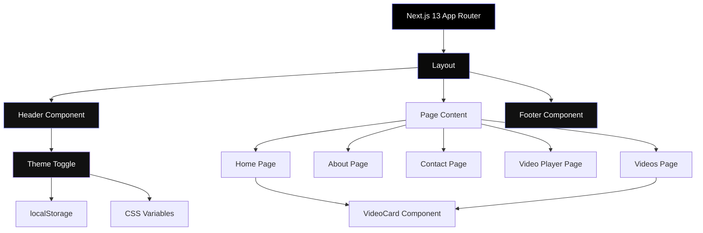
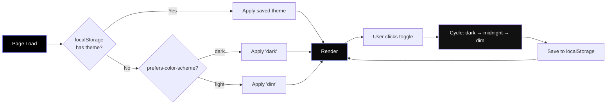
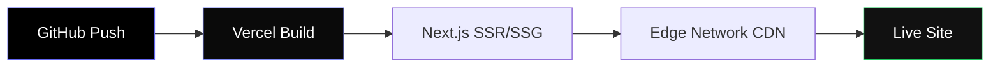
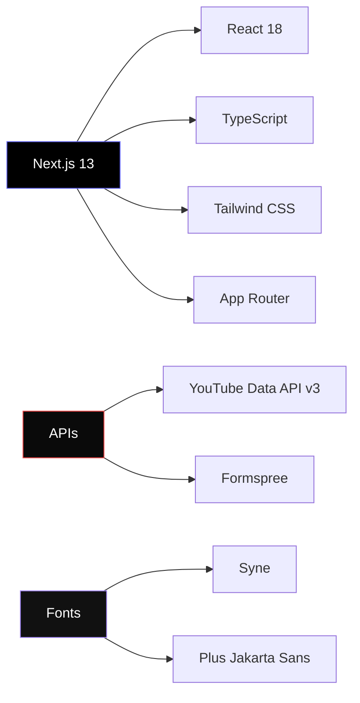

# 🎬 Genzowais — Official Channel Website

> A premium, glass-morphism YouTube channel website built with **Next.js 13**, **Tailwind CSS**, and **TypeScript**. Features a pure-black cinematic aesthetic with three switchable themes and a floating pill navigation.

[](https://vercel.com/new/clone?repository-url=https://github.com/Saff9/ytsite)

---

## ✨ Features

| Feature | Description |
|---|---|
| 🖤 **Pure Black Design** | True `#000000` background for maximum contrast |
| 🎨 **3 Themes** | Dark, Midnight (navy), Dim (warm gray) — auto-detects device preference |
| 💊 **Floating Pill Header** | Glass navbar that morphs to pill shape on scroll |
| 🔤 **Premium Typography** | Syne (headings) + Plus Jakarta Sans (body) |
| 🃏 **Glass Cards** | Backdrop-blur panels with iridescent top edges |
| 🎬 **YouTube Integration** | Auto-fetches latest videos via YouTube Data API |
| 📱 **Fully Responsive** | Mobile-first design with smooth hamburger menu |
| ⚡ **Performance** | CSS-only animations, `will-change` hints, minimal JS |
| 🌐 **SEO Optimized** | Proper meta tags, semantic HTML, Open Graph ready |

---

## 🏗️ Architecture



## 🎨 Theme System



### Theme Comparison

| Token | 🌑 Dark | 🌊 Midnight | 🌗 Dim |
|---|---|---|---|
| `--bg` | `#000000` | `#020617` | `#18181b` |
| `--text` | `#ffffff` | `#f8fafc` | `#fafafa` |
| `--accent` | `#6366f1` | `#3b82f6` | `#a78bfa` |
| Vibe | Pure black | Deep navy | Warm gray |

---

## 📁 Project Structure

```
ytsite/
├── public/
│   ├── icon.svg              # App icon (512x512)
│   └── favicon.svg           # Browser favicon (32x32)
├── src/
│   ├── app/
│   │   ├── globals.css       # Theme tokens, glass utilities, animations
│   │   ├── layout.tsx        # Root layout with theme injection
│   │   ├── page.tsx          # Home — hero, stats, video grid
│   │   ├── about/page.tsx    # About — bio, stats, values
│   │   ├── contact/page.tsx  # Contact — glass form (Formspree)
│   │   └── videos/
│   │       ├── page.tsx      # Video listing with skeleton loading
│   │       └── [id]/page.tsx # Video player with subscribe CTA
│   ├── components/
│   │   ├── Header.tsx        # Floating pill nav + theme toggle
│   │   ├── Footer.tsx        # Glass footer with brand + links
│   │   └── VideoCard.tsx     # Thumbnail card with hover effects
│   └── lib/
│       └── youtube.ts        # YouTube Data API integration
├── tailwind.config.js
├── next.config.js
├── package.json
└── README.md
```

---

## 🚀 Getting Started

### Prerequisites

- **Node.js** 18+
- **npm** or **yarn**
- A **YouTube Data API v3** key

### Installation

```bash
# Clone the repository
git clone https://github.com/Saff9/ytsite.git
cd ytsite

# Install dependencies
npm install

# Set up environment variables
cp .env.example .env.local
# Edit .env.local and add your YouTube API key

# Start development server
npm run dev
```

Open [http://localhost:3000](http://localhost:3000) in your browser.

### Environment Variables

| Variable | Description | Required |
|---|---|---|
| `YOUTUBE_API_KEY` | YouTube Data API v3 key | ✅ |
| `YOUTUBE_CHANNEL_ID` | Your YouTube channel ID | ✅ |

---

## 🌐 Deployment (Vercel)

This project is **Vercel-ready** out of the box:

1. Push to GitHub
2. Import the repo on [vercel.com](https://vercel.com)
3. Add environment variables (`YOUTUBE_API_KEY`, `YOUTUBE_CHANNEL_ID`)
4. Deploy — Vercel auto-detects Next.js

Or use the one-click deploy button at the top of this README.



---

## 🛠️ Tech Stack



---

## 📄 License

This project is open source and available under the [MIT License](LICENSE).

---

<p align="center">
  <strong>Built with ❤️ by Genzowais</strong><br/>
  <sub>Crafted with passion · Built for creators</sub>
</p>
